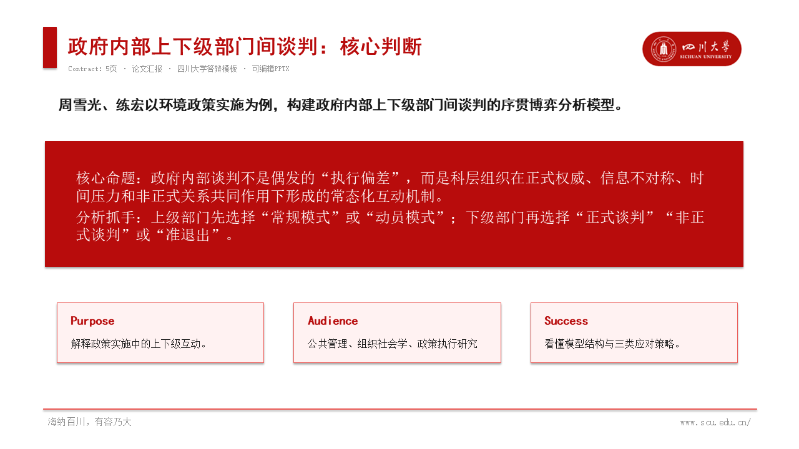
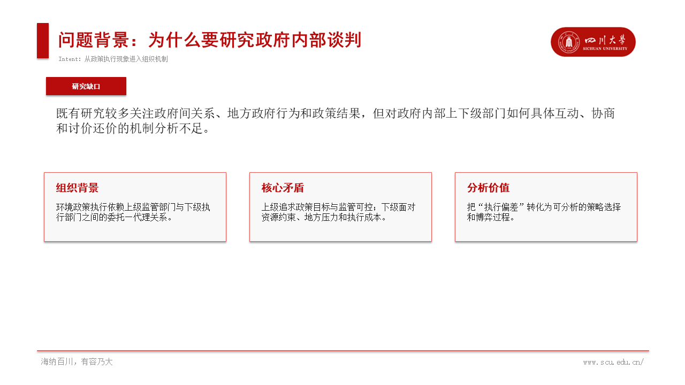
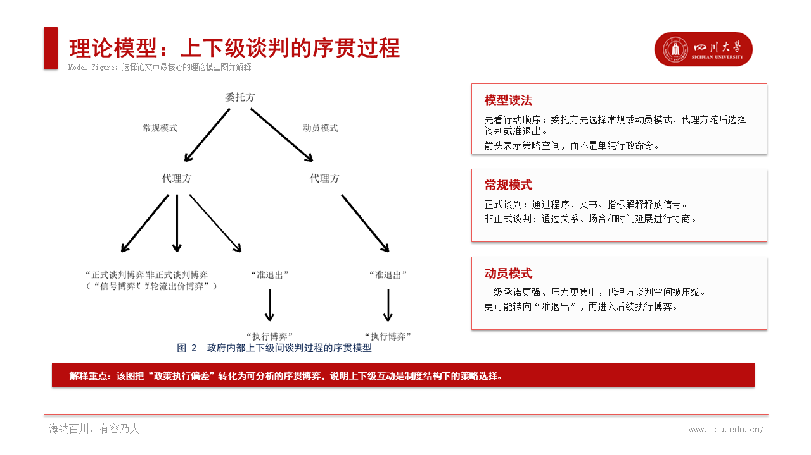
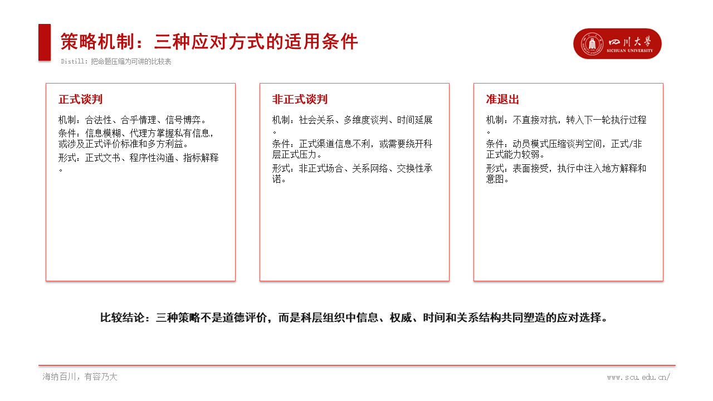
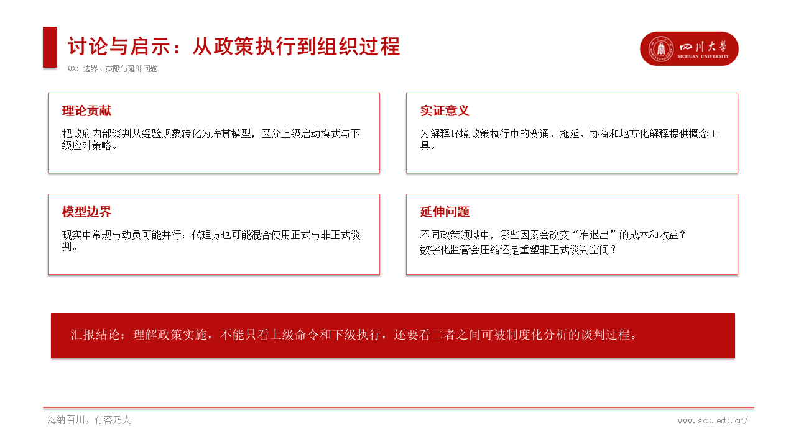

# Course PPT Workflow

作者背景：四川大学公共管理学院公共政策博士，目前为西南大学商贸学院青年教师。因此，本 skill 的问题意识、案例选择和默认讲解方式可能更适合人文社会科学方向。

一个根据原有 PPT 模板进行备课、案例解读和论文分析的 PPT skill。它更适用于人文社会科学领域，尤其是公共管理、社会学、经济学、政治学、教育学、法学、马克思主义理论、区域发展和数字经济等课程或组会场景。

它的目标很朴素：把已有课程课件的风格接住，把论文、案例、教学大纲整理成能直接讲、能继续改、不会乱版的 PowerPoint 页面。

也可以把它理解为一个“研究生组会救星”：给它一份原有 PPT 模板和一篇论文/一个案例/一段大纲，它会尽量生成符合原模板色彩、字体、页脚和内容密度的可编辑 PPT，而不是把整页做成图片。

## 可以做什么

- 根据课程原有 PPT 模板生成备课补充页。
- 把论文整理成课堂论文解读 PPT。
- 把案例材料整理成案例导入或案例分析 PPT。
- 把教学大纲压缩成概念、机制、流程、风险和结论。
- 识别并复用原模板中的校徽、学校标识或机构 logo。
- 先做生成前检查和 PPT 大纲，再进入模板化排版。
- 论文若有分析框架图、理论模型图或机制图，选择最核心的一张加入 PPT 并解释。
- 检查 PPT 中是否存在对象越界、图片数量异常等基础版式问题。

## 核心规则

- 继承原 PPT 的页面比例、主色调、标题位置、页脚线和讲义式密度。
- 输出可编辑 `.pptx`，使用文本框、形状、线条、箭头和原生 PowerPoint 元素。
- 标题使用黑体或黑体风格字体，并加粗。
- 正文、逻辑框架和说明文字使用仿宋或宋体。
- 内容只呈现要点和逻辑，避免“学生理解”“课堂导入”等主语化叙述。
- 所有文字、图形和图片都必须在页面范围内，避免文字超框、覆盖和错位。
- 对学校或机构模板，优先从校徽库匹配标识；若模板中校徽由形状和文字组成，则可从四角、页眉或页脚候选区域裁剪复用。
- 对论文原文中的核心理论模型图，优先保留原图作为视觉证据，并在旁边解释主体、关系箭头和理论含义。

## 已上传示例

已经按内容类型整理了示例材料：

- 案例解读 PPT：`examples/case_briefs/exp1_case_brief.pptx`
- 论文解读 PPT：`examples/paper_briefs/digital_finance_digital_divide_paper_brief.pptx`
- 论文 PDF 原文：`examples/paper_briefs/global_digital_divide_governance_paper.pdf`
- 模板测试：
  - 通用讲义风：《开放型通道经济发展模式视角下“西部陆海新通道”发展路径研究》测试 PPT，`examples/paper_briefs/western_land_sea_corridor_brief_test.pptx`
  - 四川大学答辩风：《政府内部上下级部门间谈判：一个分析模型》5 页论文汇报测试 PPT，`examples/paper_briefs/government_internal_negotiation_scu_template.pptx`

同时补充了两个目录的 `README.md`，并更新了总说明。

## 测试效果展示

下面展示的是人文社会科学论文《政府内部上下级部门间谈判：一个分析模型》的 5 页论文汇报测试效果，使用四川大学答辩风模板生成。该示例突出本项目更适合处理社科论文中的理论命题、分析框架、模型图、机制解释和讨论问题。

推荐使用流程：先让 AI 生成 PPT 大纲，明确每页标题、核心要点和逻辑结构；再使用这个 skill 读取原有 PPT 模板并生成可编辑 PPT。

**第 1 页：核心判断**



**第 2 页：问题背景**



**第 3 页：理论模型图与解释**



**第 4 页：策略机制**



**第 5 页：讨论与启示**



## 快速开始

安装依赖：

```powershell
pip install -r requirements.txt
```

根据示例大纲生成 PPT：

```powershell
python scripts/generate_ppt.py --outline examples/input_outline.md --output examples/output_sample.pptx
```

检查 PPT 元素是否越界：

```powershell
python scripts/validate_ppt_bounds.py examples/output_sample.pptx
```

读取一个 PPT 的基础风格信息：

```powershell
python scripts/extract_style_from_ppt.py path/to/course_template.pptx
```

识别或提取模板中的校徽：

```powershell
python scripts/extract_template_logo.py path/to/template.pptx --school 四川大学 --output assets/logos/sichuan_university_badge_red.png
```

## 仓库结构

```text
.
├─ SKILL.md
├─ prompts/
├─ scripts/
├─ examples/
│  ├─ case_briefs/
│  └─ paper_briefs/
├─ templates/
├─ docs/
├─ requirements.txt
└─ README.md
```

## 文件说明

- `SKILL.md`：备课 PPT skill 的核心规则。
- `prompts/`：可直接复用或改写的提示词。
- `scripts/generate_ppt.py`：根据 Markdown 大纲生成可编辑 PPT 示例。
- `scripts/validate_ppt_bounds.py`：检查 PPT 中是否存在对象越界。
- `scripts/extract_style_from_ppt.py`：提取 PPT 的页面尺寸、字体和颜色信息。
- `scripts/extract_template_logo.py`：从校徽库匹配，或从模板四角、页眉、页脚候选区域提取校徽。
- `scripts/validate_deck_quality.py`：检查越界、图片数量和常见反模式。
- `docs/kami_inspired_workflow.md`：记录生成前检查、大纲优先和质量检查等工作流设计。
- `assets/logos/`：校徽库，用于更稳定地识别和复用学校标识。
- `examples/case_briefs/`：案例解读类 PPT 示例。
- `examples/paper_briefs/`：论文解读类 PPT 与论文示例材料。

## License

MIT License.

## 联系方式

Email: `wjy1994211@gmail.com`

有意见和建议欢迎提出。

## 参考

本项目在工作流设计上参考了开源项目 [Kami](https://github.com/tw93/Kami) 的部分逻辑，例如生成前约束确认、材料检查、大纲优先和质量检查；视觉风格仍以用户提供的原有 PPT 模板为准。

## 打赏

觉得好用可以看心情打赏，谢谢。


