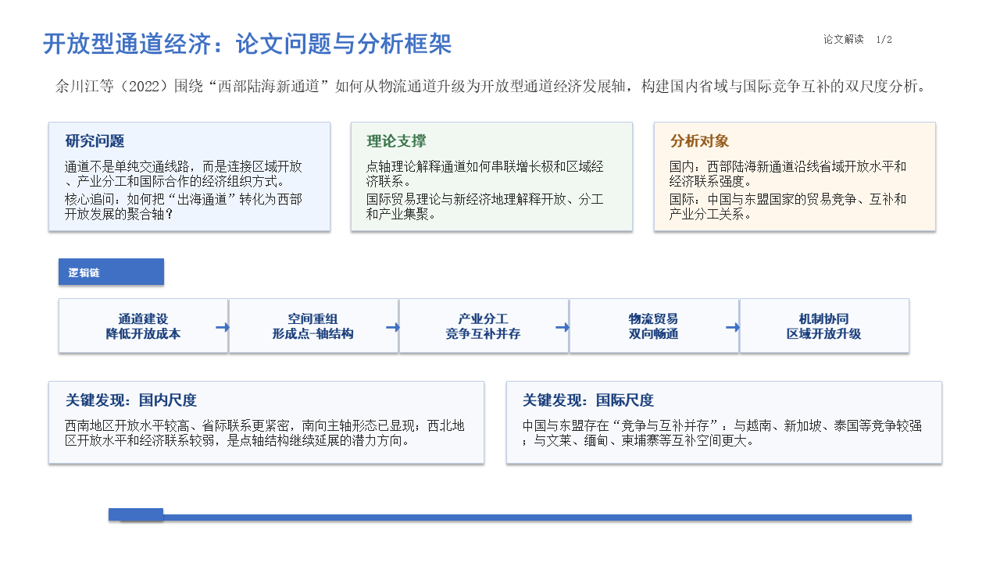
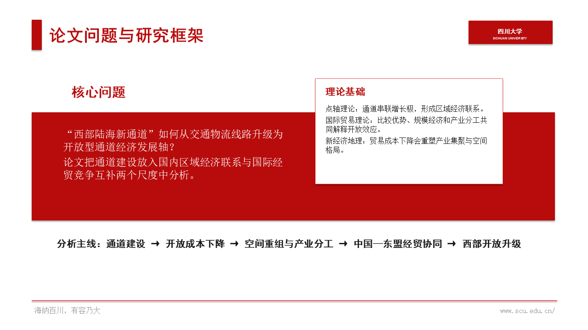

# Paper Brief Examples

本目录存放论文解读类材料。

## Files

- `digital_finance_digital_divide_paper_brief.pptx`: 论文解读 PPT 示例，主题为数字金融、数字鸿沟与包容性发展。
- `global_digital_divide_governance_paper.pdf`: 论文原文示例，题为《全球数字鸿沟治理：数字税困局、逻辑转向与中国方略》。
- `western_land_sea_corridor_brief_test.pptx`: 同一篇“西部陆海新通道”论文使用通用讲义风模板生成的测试 PPT。
- `western_land_sea_corridor_scu_template_test.pptx`: 同一篇“西部陆海新通道”论文使用四川大学答辩风模板生成的测试 PPT。

## Preview

两份测试 PPT 使用同一篇论文，只是套用了不同模板，因此适合观察“模板风格继承”带来的效果差异。

推荐流程：先生成 PPT 大纲，再使用本 skill 结合原有 PPT 模板生成可编辑 PPT。

### 通用讲义风

### 四川大学答辩风

